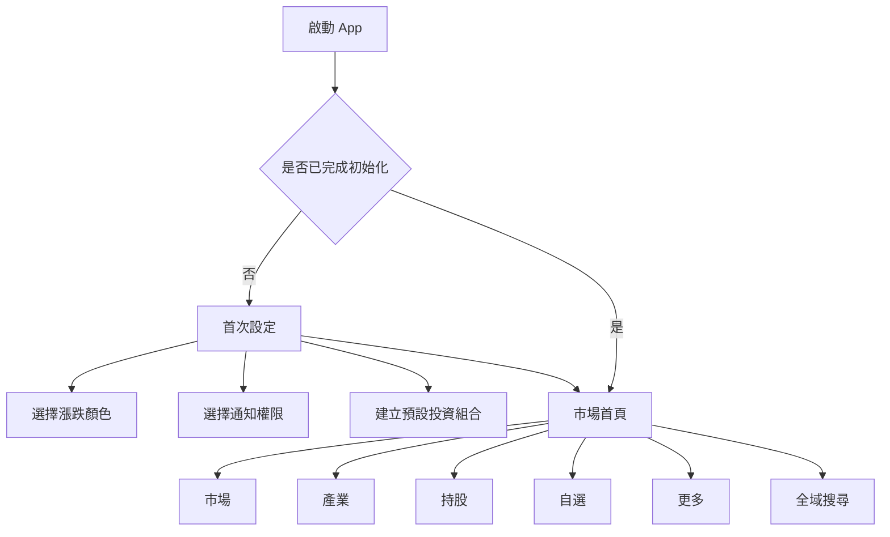
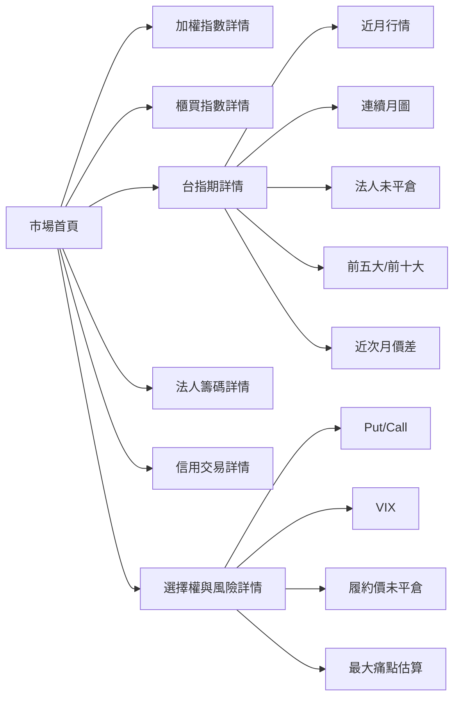
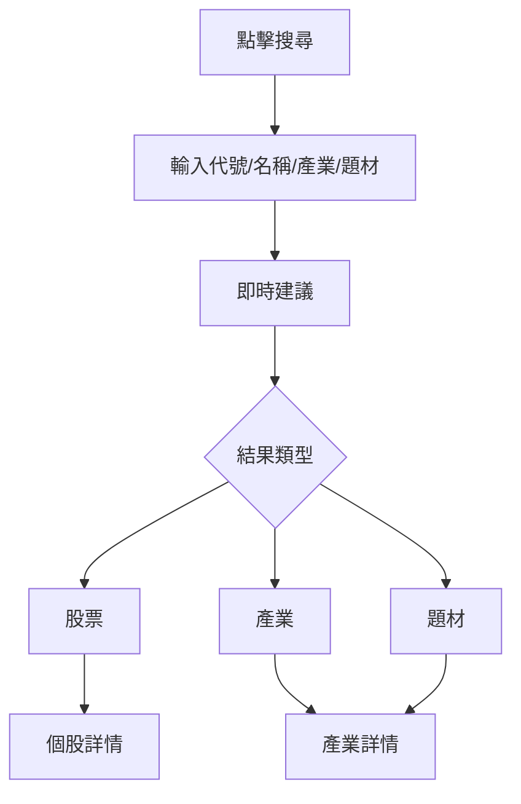
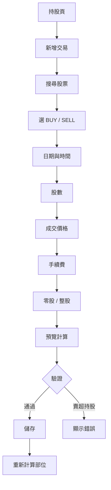
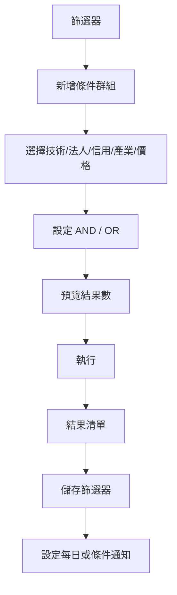

# 01 — App 畫面流程

## 1. 資訊架構

Material 3 Bottom Navigation 建議維持 5 個項目：

1. 市場
2. 產業
3. 持股
4. 自選
5. 更多

個股搜尋放在所有主要頁面的 Top App Bar，避免底部導覽超過 5 項。



## 2. 市場首頁

### 2.1 首頁區塊順序

```text
市場首頁
├── 資料狀態列
├── 加權指數／櫃買指數
├── 台指期貨／期現貨價差
├── 市場廣度
├── 三大法人現貨
├── 三大法人期貨未平倉
├── 融資／融券／借券
├── Put/Call、VIX、未平倉集中度
├── 產業強弱前五名
└── 今日觸發提醒
```

### 2.2 資料狀態列

顯示：

- 交易日期。
- 盤中／盤後／夜盤。
- 即時／延遲／最終。
- 最後更新時間。
- 上游異常時顯示 stale。

點擊後進入「資料更新狀態」。

### 2.3 現貨卡片

左右切換：

- 加權指數。
- 櫃買指數。

卡片操作：

- 點擊：進入指數詳情。
- 長按：建立價格或均線提醒。
- 切換期間：1D／5D／10D／30D／1Y／5Y。

### 2.4 期貨卡片

顯示：

- 近月台指。
- 最新價與漲跌。
- 期現貨價差。
- 成交量。
- 未平倉量及日增減。
- 距結算日。

操作：

- 點擊：進入期貨詳情。
- 切換日盤／夜盤。
- 切換近月、次月、連續月。

### 2.5 法人卡片

Tab：

- 現貨買賣超。
- 期貨未平倉。

時間：

- 今日。
- 5日。
- 10日。
- 20日。
- 60日。

法人：

- 外資。
- 投信。
- 自營商。
- 合計。

### 2.6 信用交易卡片

顯示：

- 融資餘額及增減。
- 融券餘額及增減。
- 借券賣出餘額及增減。
- 券資比。
- 20 日趨勢。

## 3. 市場詳情流程



## 4. 全域搜尋與個股頁

### 4.1 搜尋流程



### 4.2 個股詳情頁

Top Area：

- 名稱、代號、市場、產業。
- 現價、漲跌、成交量。
- 加入自選。
- 新增交易。
- 建立提醒。
- 加入比較。

Tabs：

1. 走勢
2. 籌碼
3. 信用
4. 技術
5. 概覽

#### 走勢 Tab

- 1D／5D／10D／30D／1Y／5Y。
- 分時／K 線。
- 原始／還原權息。
- 成交量。
- 指標疊加。
- 十字游標。

#### 籌碼 Tab

- 外資、投信、自營商。
- 單日與累計。
- 買賣超與股價疊圖。
- 連續買賣天數。
- 背離提示。

#### 信用 Tab

- 融資、融券、券資比。
- 借券賣出。
- 5／10／20／60 日變化。
- 價格與餘額疊圖。

#### 技術 Tab

- MA、EMA、布林、MACD、RSI、KD、OBV、ATR、Williams %R。
- 使用者修改參數。
- 近期命中條件。

## 5. 產業頁

### 5.1 產業首頁

Top Tabs：

- 官方產業。
- 題材。
- 我的產業。

排序：

- 市值加權漲跌。
- 等權漲跌。
- 成交金額。
- 法人買賣超。
- 融資增減。
- 站上月線比例。
- 綜合強度。

### 5.2 產業詳情

```text
產業詳情
├── 綜合強度與排行
├── 等權／市值加權走勢
├── 市場廣度
├── 法人與信用交易
├── 指標公司
├── 領漲／領跌
├── 成分股清單
└── 建立產業提醒
```

點擊成分股進入個股詳情。

## 6. 持股頁

### 6.1 投資組合首頁

顯示：

- 總市值。
- 總投入。
- 未實現損益。
- 已實現損益。
- 今日損益。
- 個股配置。
- 產業配置。
- 損益貢獻。
- 持股清單。

持股列顯示：

- 名稱、代號。
- 股數、平均成本。
- 現價。
- 未實現損益及報酬率。
- 距 MA5／MA20／MA60。
- 法人與信用狀態 icon。
- 最近提醒。

### 6.2 新增交易



表單只有：

- 股票代號。
- 買進／賣出。
- 日期時間。
- 股數。
- 成交價格。
- 手續費。
- 零股／整股。

### 6.3 交易紀錄

- 依股票、日期、BUY／SELL 篩選。
- 編輯。
- 刪除。
- 修改後重新計算全部後續部位快照。

## 7. 自選股頁

- 多群組切換。
- 新增群組。
- 新增／刪除股票。
- 拖曳排序。
- 欄位自訂。
- 目標價、停損價、加碼價。
- 直接建立提醒。
- 加入比較。
- 查看群組整體法人與產業分布。

## 8. 更多頁

```text
更多
├── 股票篩選器
├── 個股比較
├── 通知中心
├── 模擬投資組合
├── 報表匯出
├── 資料更新狀態
├── 顯示設定
├── 通知與勿擾
├── 雲端同步
├── 生物辨識
├── 桌面小工具
└── 關於資料與免責聲明
```

## 9. 股票篩選器流程



## 10. 個股比較

- 2 至 5 檔。
- 正規化價格起點為 100。
- 指標欄位可切換。
- 圖表與表格同步。
- 可由搜尋、個股頁、自選股加入比較籃。

## 11. 通知中心

分類：

- 市場。
- 個股。
- 持股。
- 法人。
- 信用交易。
- 期貨選擇權。
- 產業。
- 篩選器。

每則通知顯示：

- 觸發規則。
- 實際值與門檻。
- 資料時間。
- 資料狀態。
- 導向相關畫面。

## 12. 共通 UI 狀態

每個畫面都需處理：

- Loading。
- Empty。
- Error。
- Offline。
- Stale。
- Partial。
- Success。

禁止用空白畫面代表載入或無資料。
