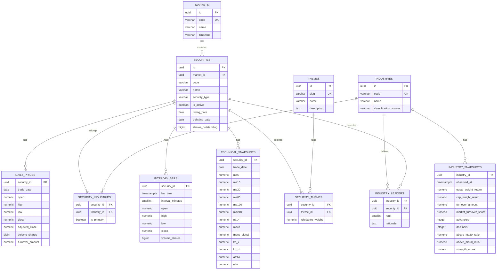
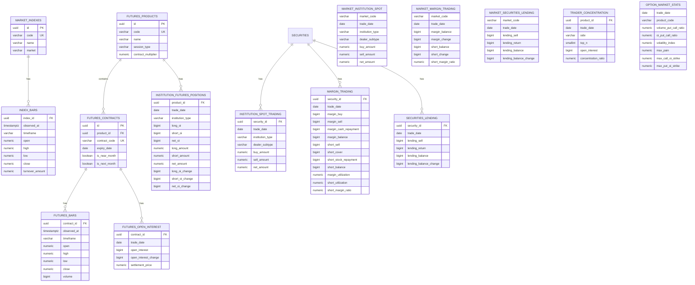
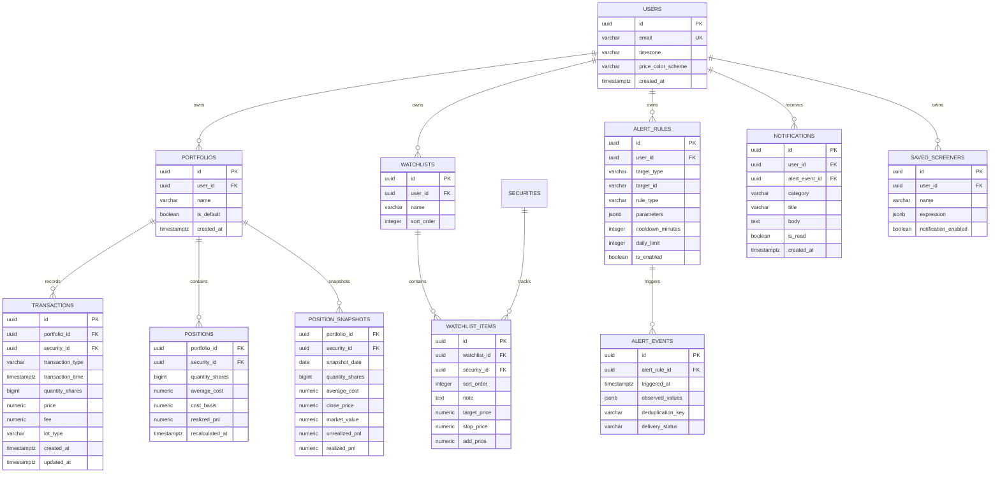

# 02 — Database ERD

## 1. 設計原則

- PostgreSQL 為主資料庫。
- 日線資料可先使用原生分區表；分鐘資料量上升後啟用 TimescaleDB。
- 所有價格、金額使用 `NUMERIC`。
- 所有交易數量以「股」儲存。
- 所有時間以 UTC 儲存。
- `trade_date` 使用台灣交易日期。
- 上游原始資料可保存於 staging schema，Domain 表使用統一欄位。
- 不建立投資組合公司事件／股利事件表。

## 2. 市場主檔 ERD



## 3. 指數、期貨、法人與信用交易 ERD



## 4. 使用者、投資組合、自選與提醒 ERD



## 5. 投資組合計算規則

### 5.1 買進

```text
new_quantity = old_quantity + buy_quantity
new_cost_basis = old_cost_basis + buy_quantity × buy_price + fee
new_average_cost = new_cost_basis / new_quantity
```

### 5.2 賣出

MVP 移動平均成本：

```text
sold_cost = sell_quantity × old_average_cost
realized_pnl = sell_quantity × sell_price - fee - sold_cost
remaining_quantity = old_quantity - sell_quantity
remaining_cost_basis = old_cost_basis - sold_cost
```

限制：

- `sell_quantity <= old_quantity`。
- 全數賣出後 quantity、average_cost、cost_basis 歸零。
- 稅額不由使用者輸入，MVP 不納入。
- 修改或刪除歷史交易後，由最早受影響日期開始重算。

## 6. Alert Rule JSON 範例

```json
{
  "rule_type": "PRICE_NEAR_MA",
  "target_type": "SECURITY",
  "target_id": "security-uuid",
  "parameters": {
    "ma_period": 20,
    "distance_percent": 0.5,
    "price_basis": "LAST"
  },
  "cooldown_minutes": 120,
  "daily_limit": 2
}
```

```json
{
  "rule_type": "FOREIGN_FUTURES_NET_OI_CHANGE",
  "target_type": "FUTURES_PRODUCT",
  "target_id": "TX",
  "parameters": {
    "operator": "LTE",
    "threshold_contracts": -5000
  },
  "cooldown_minutes": 1440,
  "daily_limit": 1
}
```

## 7. 主要索引

- `securities(market_id, code)` unique。
- `daily_prices(security_id, trade_date)` unique。
- `intraday_bars(security_id, interval_minutes, bar_time)` unique。
- `institution_spot_trading(security_id, trade_date, institution_type, dealer_subtype)` unique。
- `margin_trading(security_id, trade_date)` unique。
- `securities_lending(security_id, trade_date)` unique。
- `institution_futures_positions(product_id, trade_date, institution_type)` unique。
- `transactions(portfolio_id, transaction_time, id)`。
- `alert_events(alert_rule_id, triggered_at)`。
- `alert_events(deduplication_key)` unique where appropriate。
- PostgreSQL trigram index：`securities.name`、`themes.name`。

## 8. Data Quality 欄位

行情、法人、信用及衍生品表應額外具備：

- `source_code`
- `as_of`
- `received_at`
- `data_status`
- `source_revision`
- `ingestion_run_id`

`data_status`：

- `LIVE`
- `DELAYED`
- `PRELIMINARY`
- `FINAL`
- `STALE`
- `PARTIAL`
- `UNAVAILABLE`
